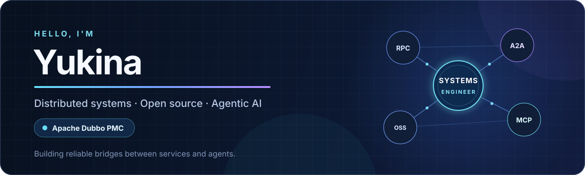

  

  <a href="mailto:rainyu@apache.org">Email</a>
  &nbsp;·&nbsp;
  <a href="https://github.com/apache/dubbo">Apache Dubbo</a>
  &nbsp;·&nbsp;
  <a href="https://github.com/search?q=author%3ARainYuY+type%3Apr&type=pullrequests">Open-source contributions</a>

I build infrastructure for systems that need to stay understandable under pressure—whether the traffic comes from services or AI agents.

I'm **Yukina**, an [Apache Dubbo](https://dubbo.apache.org/) PMC member and Java open-source contributor based in China. My work sits at the intersection of **distributed systems**, **service governance**, and **agent infrastructure**.

## Current focus

- **Distributed systems** — RPC, protocol design, service governance, reliability, and security in Apache Dubbo.
- **Agent infrastructure** — production-grade Java agents, A2A interoperability, and MCP integration.
- **Open source** — maintaining projects, reviewing changes, shipping releases, and turning edge cases into durable fixes.

## Selected work

| Project | What I work on |
| --- | --- |
| [apache/dubbo](https://github.com/apache/dubbo) | PMC member; maintaining the Java RPC and microservice framework across transport, governance, security, agent integration, and releases. |
| [agentscope-ai/agentscope-java](https://github.com/agentscope-ai/agentscope-java) | Contributor; improving long-running agent reliability, A2A behavior, runtime isolation, and safety. |
| [a2aproject/a2a-java](https://github.com/a2aproject/a2a-java) | Contributor to the official Java SDK for the Agent2Agent protocol. |

## Toolbox

`Java` · `Go` · `RPC` · `Microservices` · `Netty` · `Maven` · `A2A` · `MCP` · `Agent Frameworks`

## Beyond code

When I'm not debugging distributed systems, I'm probably in a **CS2** match. I'm also open to thoughtful opportunities with strong engineering and a healthy **work-life balance (WLB)**.

If you'd like to talk about Dubbo, Java, agents, or open source, reach me at **[rainyu@apache.org](mailto:rainyu@apache.org)** or on WeChat at **Momoka_Ryo**.
